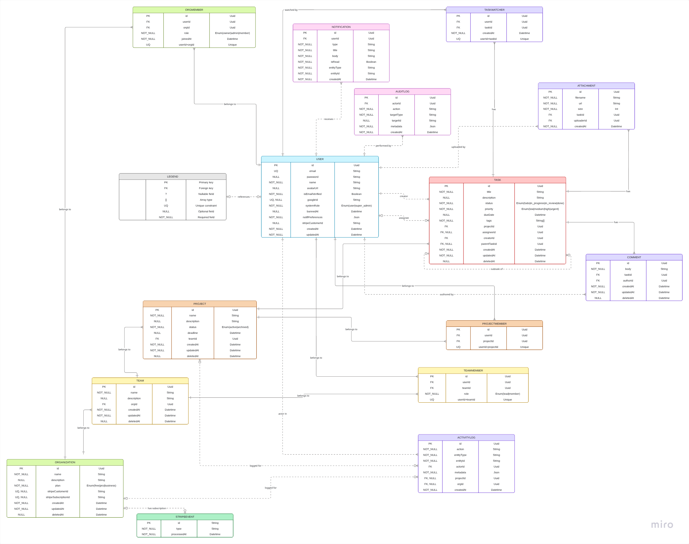

# Velo Database Schema Documentation

## Overview

Velo uses **PostgreSQL** as its primary database, accessed through **Prisma ORM**. The schema is defined in `prisma/schema.prisma` and managed with `prisma migrate`. All IDs are UUIDs generated by the database. Soft deletes are implemented via a nullable `deletedAt` timestamp; no records are hard-deleted except Stripe event deduplication.

---

## Full Prisma Schema



### Datasource & Generator

```prisma
datasource db {
  provider = "postgresql"
  url      = env("DATABASE_URL")
}

generator client {
  provider = "prisma-client-js"
}
```

---

### Enums

```prisma
enum SystemRole    { USER        SUPER_ADMIN }
enum OrgRole       { OWNER       ADMIN       MEMBER }
enum Plan          { FREE        PRO         BUSINESS }
enum TeamRole      { LEAD        MEMBER }
enum ProjectStatus { ACTIVE      ARCHIVED }
enum TaskStatus    { TODO        IN_PROGRESS  IN_REVIEW  DONE }
enum Priority      { LOW         MEDIUM       HIGH       URGENT }
```

---

### Models

#### `User` Core actor

```prisma
model User {
  id               String      @id @default(uuid())
  email            String      @unique
  password         String?                         // null for OAuth users
  name             String
  avatarUrl        String?
  isEmailVerified  Boolean     @default(false)
  googleId         String?     @unique
  systemRole       SystemRole  @default(USER)
  bannedAt         DateTime?                       // non-null = banned
  notifPreferences Json        @default("{}")
  stripeCustomerId String?     @unique
  createdAt        DateTime    @default(now())
  updatedAt        DateTime    @updatedAt

  // Relations
  memberships        OrgMember[]
  teamMemberships    TeamMember[]
  projectMemberships ProjectMember[]
  assignedTasks      Task[]          @relation("Assignee")
  createdTasks       Task[]          @relation("Creator")
  comments           Comment[]
  attachments        Attachment[]
  activityLogs       ActivityLog[]   @relation("Actor")
  notifications      Notification[]
  taskWatchers       TaskWatcher[]
  auditLogs          AuditLog[]
}
```

**Notes:**

- No token columns, all auth state (JWT blacklist, refresh tokens, reset tokens) lives in **Redis**.
- `isEmailVerified` blocks org creation until verified.
- `bannedAt` checked in middleware; banned users get `403` on all requests.

---

#### `Organization` Tenant root

```prisma
model Organization {
  id                   String    @id @default(uuid())
  name                 String
  description          String?
  plan                 Plan      @default(FREE)
  stripeCustomerId     String?   @unique
  stripeSubscriptionId String?   @unique
  createdAt            DateTime  @default(now())
  updatedAt            DateTime  @updatedAt
  deletedAt            DateTime?                  // soft delete

  members    OrgMember[]
  teams      Team[]
  activityLogs ActivityLog[]
}
```

**Plan seat limits enforced by `PlanGuard`:**

| Plan     | Members | Monthly |
| -------- | ------- | ------- |
| FREE     | 3       | $0      |
| PRO      | 20      | $9      |
| BUSINESS | ∞       | $29     |

---

#### `OrgMember` User ↔ Organization junction

```prisma
model OrgMember {
  id       String  @id @default(uuid())
  userId   String
  orgId    String
  role     OrgRole @default(MEMBER)
  joinedAt DateTime @default(now())

  user User         @relation(fields: [userId], references: [id])
  org  Organization @relation(fields: [orgId], references: [id])

  @@unique([userId, orgId])
}
```

---

#### `Team` Scoped to an Organization

```prisma
model Team {
  id          String    @id @default(uuid())
  name        String
  description String?
  orgId       String
  createdAt   DateTime  @default(now())
  updatedAt   DateTime  @updatedAt
  deletedAt   DateTime?

  org      Organization @relation(fields: [orgId], references: [id])
  members  TeamMember[]
  projects Project[]
}
```

**Cascade on soft-delete:** Sets child projects to `status: ARCHIVED` (NOT `deletedAt`), so data is preserved if team is restored.

---

#### `TeamMember` User ↔ Team junction

```prisma
model TeamMember {
  id     String   @id @default(uuid())
  userId String
  teamId String
  role   TeamRole @default(MEMBER)

  user User @relation(fields: [userId], references: [id])
  team Team @relation(fields: [teamId], references: [id])

  @@unique([userId, teamId])
}
```

---

#### `Project` Scoped to a Team

```prisma
model Project {
  id          String        @id @default(uuid())
  name        String
  description String?
  status      ProjectStatus @default(ACTIVE)
  deadline    DateTime?
  teamId      String
  createdAt   DateTime      @default(now())
  updatedAt   DateTime      @updatedAt
  deletedAt   DateTime?

  team        Team            @relation(fields: [teamId], references: [id])
  members     ProjectMember[]
  tasks       Task[]
  activityLogs ActivityLog[]
}
```

**Two inactive states:**

| State        | How set                        | Visible | Writable |
| ------------ | ------------------------------ | ------- | -------- |
| `ARCHIVED`   | `PATCH { status: "ARCHIVED" }` | Yes     | No       |
| Soft-deleted | `DELETE /:id`                  | No      | No       |

---

#### `ProjectMember` User ↔ Project junction

```prisma
model ProjectMember {
  id        String @id @default(uuid())
  userId    String
  projectId String

  user    User    @relation(fields: [userId], references: [id])
  project Project @relation(fields: [projectId], references: [id])

  @@unique([userId, projectId])
}
```

---

#### `Task` Core work unit

```prisma
model Task {
  id           String     @id @default(uuid())
  title        String
  description  String?
  status       TaskStatus @default(TODO)
  priority     Priority   @default(MEDIUM)
  dueDate      DateTime?
  tags         String[]                    // PostgreSQL array
  projectId    String
  assigneeId   String?
  creatorId    String
  parentTaskId String?                     // self-ref for subtasks

  createdAt DateTime  @default(now())
  updatedAt DateTime  @updatedAt
  deletedAt DateTime?                      // soft delete; recoverable within 30 days

  project      Project      @relation(fields: [projectId], references: [id])
  assignee     User?        @relation("Assignee", fields: [assigneeId], references: [id])
  creator      User         @relation("Creator", fields: [creatorId], references: [id])
  parent       Task?        @relation("Subtasks", fields: [parentTaskId], references: [id])
  subtasks     Task[]       @relation("Subtasks")
  comments     Comment[]
  watchers     TaskWatcher[]
  attachments  Attachment[]
  activityLogs ActivityLog[]
}
```

**Status machine (enforced in `TasksService`):**

```text
TODO ──► IN_PROGRESS ──► IN_REVIEW ──► DONE
```

Invalid transitions return `422 Unprocessable Entity`.

**Parent task auto-completion:** When all subtasks reach `DONE`, the parent task automatically transitions to `DONE`.

**Full-text search:** PostgreSQL `to_tsvector` index on `title` and `description`.

**Idempotency:** `POST /tasks` accepts `Idempotency-Key` header; cached response returned from Redis for 24h on duplicate keys.

---

#### `Comment`

```prisma
model Comment {
  id        String    @id @default(uuid())
  body      String
  taskId    String
  authorId  String
  createdAt DateTime  @default(now())
  updatedAt DateTime  @updatedAt
  deletedAt DateTime?            // body replaced with "[deleted]" on soft-delete

  task   Task @relation(fields: [taskId], references: [id])
  author User @relation(fields: [authorId], references: [id])
}
```

**@Mention parsing:** After save, body is scanned for `@username` patterns; each match triggers a `MENTIONED` notification.

---

#### `Attachment`

```prisma
model Attachment {
  id         String   @id @default(uuid())
  filename   String
  url        String                  // Cloudinary / S3 URL
  size       Int                     // bytes; max 10 MB = 10_485_760
  taskId     String
  uploaderId String
  createdAt  DateTime @default(now())

  task     Task @relation(fields: [taskId], references: [id])
  uploader User @relation(fields: [uploaderId], references: [id])
}
```

---

#### `ActivityLog`

```prisma
model ActivityLog {
  id         String   @id @default(uuid())
  action     String                   // e.g. "task.status.changed"
  entityType String                   // "Task" | "Project" | "Organization"
  entityId   String
  actorId    String
  metadata   Json     @default("{}")  // { from, to, field }
  projectId  String?
  orgId      String?
  createdAt  DateTime @default(now())

  actor   User          @relation("Actor", fields: [actorId], references: [id])
  project Project?      @relation(fields: [projectId], references: [id])
  org     Organization? @relation(fields: [orgId], references: [id])
}
```

**Tracked events:** task created, status changed, assignee changed, priority changed, due date changed, comment added, attachment added, member added/removed.

---

#### `TaskWatcher`

```prisma
model TaskWatcher {
  id        String   @id @default(uuid())
  userId    String
  taskId    String
  createdAt DateTime @default(now())

  user User @relation(fields: [userId], references: [id])
  task Task @relation(fields: [taskId], references: [id])

  @@unique([userId, taskId])
}
```

---

#### `Notification`

```prisma
model Notification {
  id         String   @id @default(uuid())
  userId     String
  type       String                    // NotificationType enum
  title      String
  body       String
  isRead     Boolean  @default(false)
  entityType String
  entityId   String
  createdAt  DateTime @default(now())

  user User @relation(fields: [userId], references: [id])
}
```

**Delivery:** Written to DB → emitted via WebSocket to `user:{id}` room as `notification:new` event.

---

#### `AuditLog`

```prisma
model AuditLog {
  id         String   @id @default(uuid())
  actorId    String
  action     String             // e.g. "admin.user.banned"
  targetType String             // "User" | "Organization" | "Queue"
  targetId   String?
  metadata   Json     @default("{}")
  createdAt  DateTime @default(now())

  actor User @relation(fields: [actorId], references: [id])
}
```

**Scope:** Only admin actions (`/admin/*`). Domain events use `ActivityLog` instead.

---

#### `StripeEvent`

```prisma
model StripeEvent {
  id          String   @id      // Stripe event ID: evt_xxx
  type        String
  processedAt DateTime @default(now())
}
```

**Purpose:** Idempotency guard for Stripe webhooks. Inserting a duplicate event ID fails on PK conflict, preventing double-processing of billing events.

---

## 🔑 Indexes

All high-frequency query fields have explicit Prisma/PostgreSQL indexes:

| Model           | Indexed Fields                                                                           |
| --------------- | ---------------------------------------------------------------------------------------- |
| `User`          | `email`, `googleId`, `stripeCustomerId`                                                  |
| `Organization`  | `stripeCustomerId`, `stripeSubscriptionId`, `deletedAt`                                  |
| `Task`          | `projectId`, `assigneeId`, `creatorId`, `status`, `deletedAt`, `dueDate`, `parentTaskId` |
| `Comment`       | `taskId`, `authorId`, `deletedAt`                                                        |
| `Notification`  | `userId`, `isRead`                                                                       |
| `ActivityLog`   | `entityId`, `entityType`, `actorId`, `projectId`                                         |
| `OrgMember`     | `(userId, orgId)` composite unique                                                       |
| `TeamMember`    | `(userId, teamId)` composite unique                                                      |
| `ProjectMember` | `(userId, projectId)` composite unique                                                   |
| `TaskWatcher`   | `(userId, taskId)` composite unique                                                      |

---

## 🔴 Redis Schema (Transient State)

Token and cache state lives in Redis, not PostgreSQL:

| Key Pattern                  | TTL      | Content                       |
| ---------------------------- | -------- | ----------------------------- |
| `refresh:{userId}`           | 7 days   | Hashed refresh token          |
| `blacklist:{jti}`            | ≤15 min  | Invalidated access token JTI  |
| `reset:{userId}`             | 1 hour   | Password reset token          |
| `verify:{userId}`            | 24 hours | Email verification token      |
| `ai-rate:{userId}`           | 1 hour   | AI request counter (max 10)   |
| `idempotency:{key}`          | 24 hours | Cached task creation response |
| `cache:project-board:{id}`   | 30 sec   | Kanban board grouped response |
| `cache:project-members:{id}` | 2 min    | Project member list           |
| `cache:org-plan:{id}`        | 5 min    | Org plan lookup               |
| `cache:user-profile:{id}`    | 10 min   | User profile data             |
| `lock:{resource}:{id}`       | 10 sec   | Distributed lock (SETNX)      |

---

## 🏗️ Migrations

Managed via Prisma Migrate:

```bash
# Development (auto-migrate on schema change)
npx prisma migrate dev --name <migration_name>

# Production (apply pending migrations)
npx prisma migrate deploy

# Reset DB (dev/test only)
npx prisma migrate reset

# Inspect DB state
npx prisma studio
```

---

## 🌱 Seeding

```bash
npx prisma db seed
```

Seeds: 1 Super Admin user, sample organization, team, project, and tasks for development/demo.
